---

## 前言

使用VS开发linux项目会顺手一些，这里配置一下如何使用SSH服务使VS连接上linux，linux系统下需要提前安装好openssh-server，并启动它，如果想开发C项目，因为项目默认是C++，所以也需要提前安装好g++编译器，否则编译调试会报错

## 1.先安装VS的linux工具

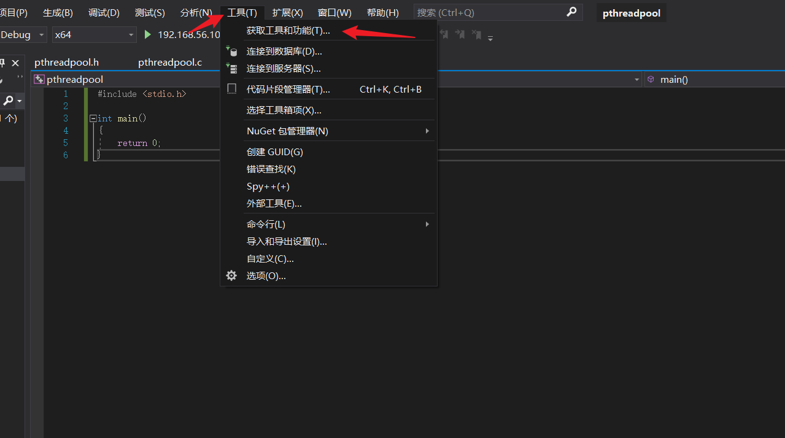

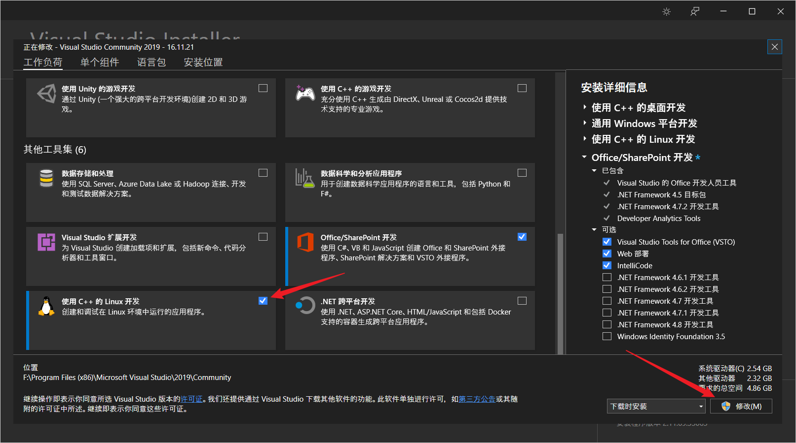

## 2.创建一个基于linux的项目（我这里写C代码，选择C++）

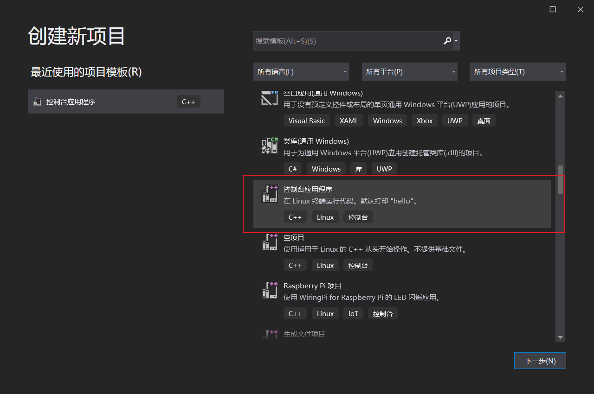

## 3.连接linux主机

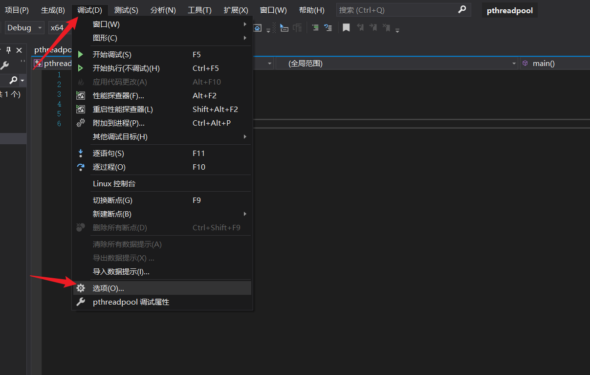

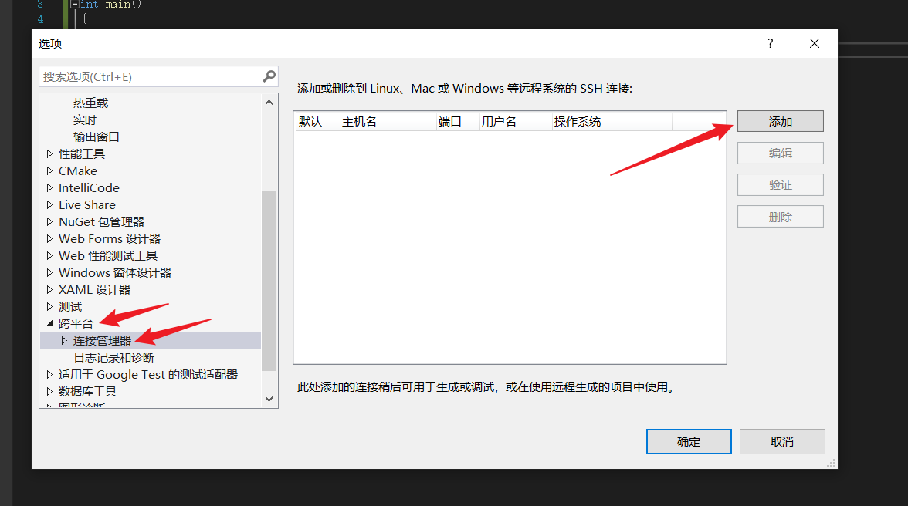

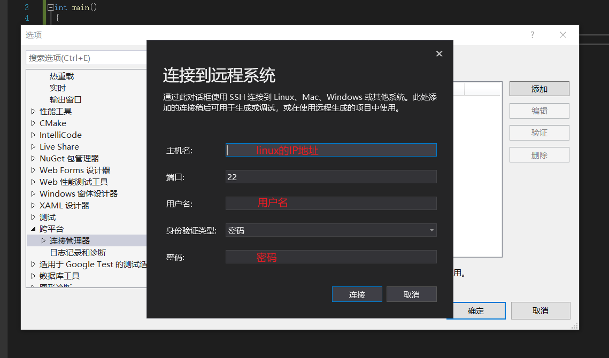

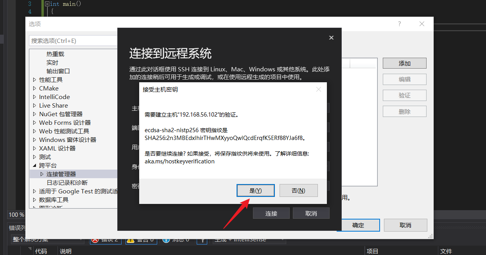

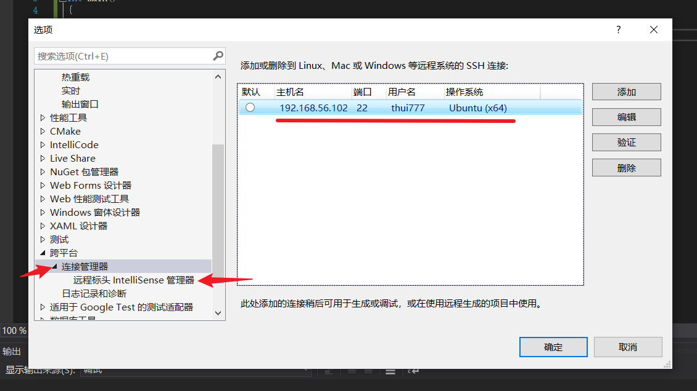

## 3.下载linux标头

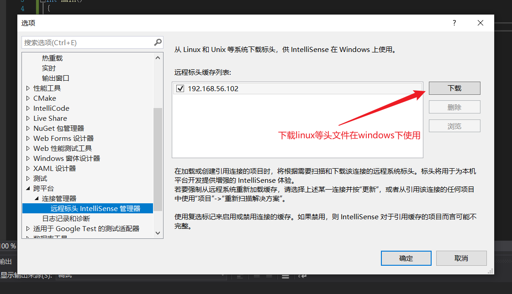

## 4.查看项目在linux下保存的位置

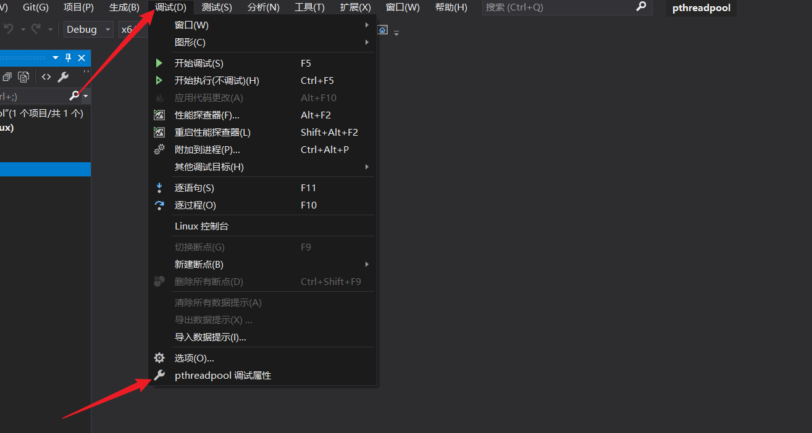

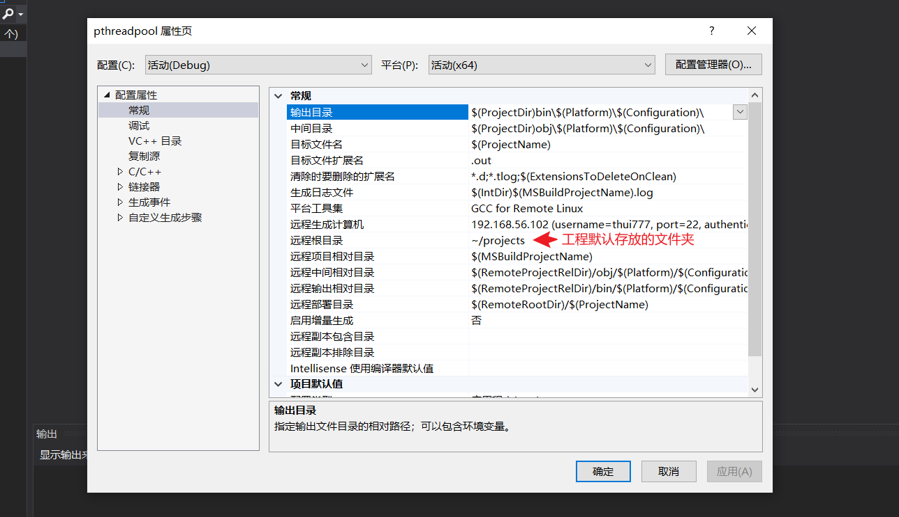
