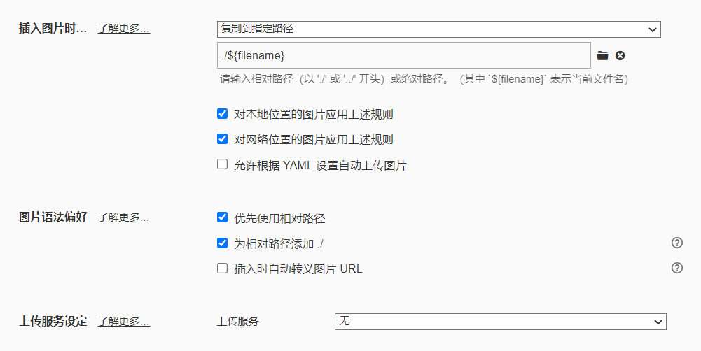

-------------

## 前言

在写博客时除了代码和文本以外，怎么插入图像是非常要重要的，这里记录一下插入方法，方便以后查阅

## 步骤

#### 1.先打开Typero的偏好设置，选择图像

#### 2.下载插件

~~~shell
npm install https://github.com/CodeFalling/hexo-asset-image --save
#直接用下面这个是显示不了图片的
npm install hexo-asset-image --save
~~~

#### 3.修改_config.yml

~~~yaml
post_asset_folder: true
~~~

